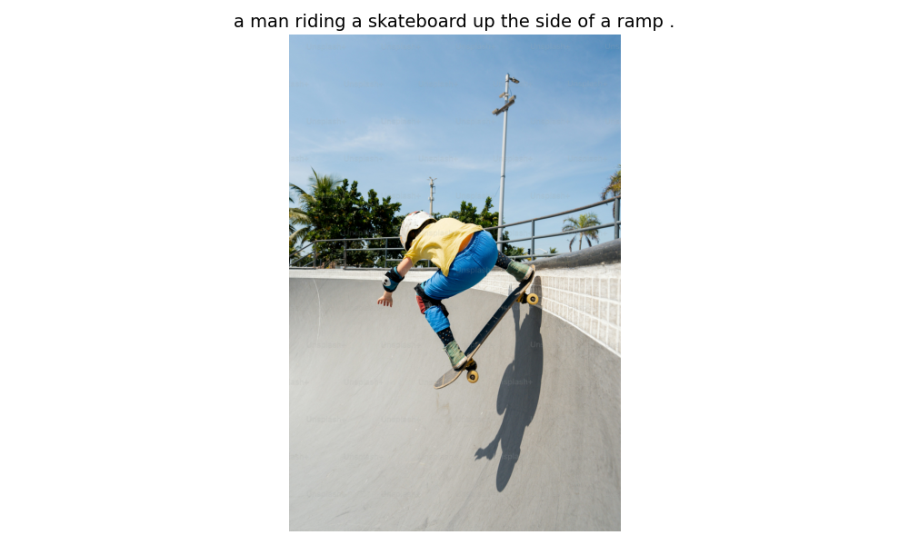

# 🖼️ CNN-LSTM Image Captioning with PyTorch

**이미지를 이해하고 자연어로 설명하는 딥러닝 모델**  
ResNet-152 CNN Encoder와 LSTM Decoder를 결합한 이미지 캡셔닝 시스템

---

## 📌 프로젝트 개요

이 프로젝트는 **Encoder-Decoder 아키텍처**를 사용하여 이미지의 내용을 자동으로 설명하는 자연어 문장을 생성합니다.

### 주요 특징
- **CNN 인코더**: ImageNet으로 사전 학습된 ResNet-152를 사용하여 이미지 특징 추출
- **LSTM 디코더**: 순환 신경망으로 문맥을 고려한 단어 시퀀스 생성
- **COCO 데이터셋**: 약 41만 개의 이미지-캡션 쌍으로 학습
- **Teacher Forcing**: 효율적인 학습을 위한 정답 기반 학습 전략
- **Greedy Search**: 추론 시 단계별 최적 단어 선택

---

## 🏗️ 모델 아키텍처

```

┌─────────────┐      ┌──────────────┐      ┌────────────────┐

│   입력 이미지  │  →  │  CNN Encoder │  →  │ 특징 벡터(256D) │

│ (224×224×3) │      │ (ResNet-152) │      │                │

└─────────────┘      └──────────────┘      └────────────────┘

↓

┌────────────────┐

│ LSTM Decoder   │

│ (Hidden: 512D) │

└────────────────┘

↓

┌────────────────┐

│ 생성된 캡션      │

│ "A dog playing"│

└────────────────┘

```

### 데이터 흐름 (batch_size=128 기준)
1. **이미지 입력**: `(128, 3, 224, 224)`
2. **CNN 특징 추출**: `(128, 2048)` → Linear → `(128, 256)`
3. **LSTM 입력**: 이미지 벡터 + 단어 임베딩 → `(128, seq_len, 256)`
4. **단어 예측**: `(total_words, vocab_size)` → Softmax → 다음 단어 선택

---

## 📊 학습 결과

### 성능 지표
- **최종 Loss**: 2.1087
- **Perplexity**: 8.2372
- **학습 Epoch**: 2 epochs
- **배치 크기**: 128
- **Vocabulary Size**: 9,948개 단어

### 예측 결과 샘플

<div style="text-align: center;">
    <h3>Image 1</h3>
    
    <p style="font-size: 1.2em; font-weight: bold; color: #333; margin-top: 10px;">Generated Caption: a man in a kitchen preparing food in a kitchen.</p>
    <br>
</div>

<div style="text-align: center;">
    <h3>Image 2</h3>
    
    <p style="font-size: 1.2em; font-weight: bold; color: #333; margin-top: 10px;">Generated Caption: a baseball player is swinging at a ball.</p>
    <br>
</div>

<div style="text-align: center;">
    <h3>Image 3</h3>
    
    <p style="font-size: 1.2em; font-weight: bold; color: #333; margin-top: 10px;">Generated Caption: a man riding a skateboard up the side of a ramp.</p>
    <br>
</div>
---

## 🚀 빠른 시작

### 1. 환경 설정

```

# 레포지토리 클론

git clone https://github.com/juyeong82/cnn-lstm-image-captioning.git

cd cnn-lstm-image-captioning

# 가상 환경 생성 (권장)

python -m venv venv

source venv/bin/activate  # Windows: venvScriptsactivate

# 필수 패키지 설치

pip install -r requirements.txt

# NLTK 데이터 다운로드

python -c "import nltk; [nltk.download](http://nltk.download)('punkt')"

```

### 2. 데이터 준비

```

# COCO 데이터셋 다운로드 (약 13GB)

mkdir -p data_dir

cd data_dir

# 학습 이미지

wget http://images.cocodataset.org/zips/train2014.zip

unzip [train2014.zip](http://train2014.zip)

# Annotation 파일

wget http://images.cocodataset.org/annotations/annotations_trainval2014.zip

unzip annotations_[trainval2014.zip](http://trainval2014.zip)

cd ..

```

### 3. 단어 사전 구축

```

from src.utils import build_vocabulary, save_vocabulary

# 단어 사전 생성 (threshold=4: 4번 이상 등장한 단어만 포함)

vocab = build_vocabulary(

'data_dir/annotations/captions_train2014.json',

threshold=4

)

# 저장

save_vocabulary(vocab, 'data_dir/vocabulary.pkl')

print(f"Vocabulary size: {len(vocab)}")  # 약 9,948개 단어

```

### 4. 모델 학습

```

python src/[train.py](http://train.py)

```

학습 중 로그:
```

Epoch [0/5], Step [0/3236], Loss: 9.2052, Perplexity: 9948.82

Epoch [0/5], Step [10/3236], Loss: 5.7601, Perplexity: 317.36

...

Epoch [1/5], Step [3230/3236], Loss: 2.1087, Perplexity: 8.24

```

**체크포인트 저장**: 1000 스텝마다 `models_dir/encoder-{epoch}-{step}.ckpt`, `decoder-{epoch}-{step}.ckpt` 저장

### 5. 캡션 생성 (추론)

```

python src/[evaluate.py](http://evaluate.py)

```

또는 Python 코드로:

```

from src.evaluate import generate_caption

from src.models import CNNModel, LSTMModel

from src.utils import load_vocabulary

import torch

from torchvision import transforms

# 설정

device = torch.device('cuda' if [torch.cuda.is](http://torch.cuda.is)_available() else 'cpu')

transform = transforms.Compose([

transforms.ToTensor(),

transforms.Normalize((0.485, 0.456, 0.406), (0.229, 0.224, 0.225))

])

# 단어 사전 로드

vocab = load_vocabulary('data_dir/vocabulary.pkl')

# 모델 로드

encoder = CNNModel(256).to(device)

decoder = LSTMModel(256, 512, len(vocab), 1).to(device)

encoder.load_state_dict(torch.load('models_dir/encoder-2-3000.ckpt'))

decoder.load_state_dict(torch.load('models_dir/decoder-2-3000.ckpt'))

# 캡션 생성

caption = generate_caption(

'path/to/your/image.jpg',

encoder, decoder, vocab, device, transform

)

print(caption)

```

---

## 📂 프로젝트 구조

```

cnn-lstm-image-captioning/

├── [README.md](http://README.md)                 # 프로젝트 설명서

├── requirements.txt          # 의존성 패키지

├── .gitignore               # Git 제외 파일

│

├── src/                     # 소스 코드

│   ├── **init**.py          # 패키지 초기화

│   ├── [models.py](http://models.py)            # CNNModel, LSTMModel 정의

│   ├── [dataset.py](http://dataset.py)           # CustomCocoDataset, DataLoader

│   ├── [train.py](http://train.py)             # 학습 스크립트

│   ├── [evaluate.py](http://evaluate.py)          # 추론 및 평가

│   └── [utils.py](http://utils.py)             # Vocab, 이미지 로딩 등

│

├── notebooks/               # Jupyter 노트북

│   └── image_captioning_full.ipynb

│

├── data/                    # 데이터 폴더 (.gitignore)

│   ├── train2014/           # COCO 학습 이미지

│   ├── annotations/         # COCO annotation JSON

│   └── vocabulary.pkl       # 구축된 단어 사전

│

├── models/                  # 학습된 모델 (.gitignore)

│   ├── encoder-2-3000.ckpt  # 인코더 가중치

│   └── decoder-2-3000.ckpt  # 디코더 가중치

│

└── results/                 # 결과물

├── sample_predictions/  # 예측 결과 이미지

└── training_logs/       # 학습 로그

```

---

## 🛠️ 기술 스택

### 딥러닝 프레임워크
- **PyTorch 2.0+**: 모델 구현 및 학습
- **torchvision**: 사전 학습된 ResNet-152, 이미지 전처리

### 데이터 처리
- **pycocotools**: COCO 데이터셋 처리
- **NLTK**: 자연어 토큰화 (punkt tokenizer)
- **Pillow**: 이미지 로딩 및 리사이즈

### 시각화
- **matplotlib**: 결과 시각화

---

## 📈 핵심 개념

### 1. Encoder-Decoder 아키텍처
- **인코더 (CNN)**: 이미지 → 고정 길이 특징 벡터 (256차원)로 압축
- **디코더 (LSTM)**: 특징 벡터 → 단어 시퀀스로 디코딩


### 2. Teacher Forcing
학습 시 이전 예측 단어가 아닌 **정답 단어**를 다음 입력으로 사용하여 학습 속도 향상:
```

# t=1: 이미지 → "A"

# t=2: "A" (정답) → "dog"

# t=3: "dog" (정답) → "playing"

```

### 3. Greedy Search (추론 시)
각 시점에서 **가장 확률이 높은 단어**를 선택하여 문장 생성:
```

for t in range(max_length):

logits = model(input_t)

word = argmax(logits)  # 최대 확률 단어 선택

input_t+1 = embedding(word)

```

### 4. Pack Padded Sequence
가변 길이 캡션을 효율적으로 처리하기 위해 패딩된 시퀀스를 압축:
```

packed = pack_padded_sequence(embeddings, lengths, batch_first=True)

```

---

## 🔑 주요 클래스 및 함수

### `src/[models.py](http://models.py)`

**CNNModel**
- `__init__(embedding_size)`: ResNet-152 기반 인코더 초기화
- `forward(images)`: 이미지 → 특징 벡터 (256D) 변환

**LSTMModel**
- `__init__(embed_size, hidden_size, vocab_size, num_layers)`: LSTM 디코더 초기화
- `forward(features, captions, lengths)`: 학습 시 사용 (Teacher Forcing)
- `sample(features, states)`: 추론 시 캡션 생성 (Greedy Search)

### `src/[dataset.py](http://dataset.py)`

**CustomCocoDataset**
- `__getitem__(idx)`: (이미지, 캡션) 쌍 반환

**collate_function**
- 가변 길이 캡션을 배치로 묶고 패딩 적용

**get_loader**
- DataLoader 생성 헬퍼 함수

### `src/[utils.py](http://utils.py)`

**Vocab**
- `add_token(token)`: 단어 추가
- `__call__(token)`: 단어 → 인덱스 변환

**build_vocabulary**
- COCO JSON에서 단어 사전 구축

**load_image**
- 추론용 이미지 전처리

---


## 📝 학습 하이퍼파라미터 튜닝
```

# src/[train.py](http://train.py)의 config 수정

config = {

'embedding_size': 256,      # 임베딩 차원 (256, 512 권장)

'hidden_size': 512,         # LSTM hidden size (512, 1024 권장)

'num_layers': 1,            # LSTM 레이어 수

'learning_rate': 0.001,     # 학습률 (0.001~0.0001)

'batch_size': 128,          # 배치 크기 (GPU 메모리에 따라 조정)

}

```

### GPU 메모리 부족 시
- `batch_size` 줄이기 (128 → 64 → 32)
- `num_workers` 줄이기 (2 → 0)
- 이미지 크기 줄이기 (224 → 196)

---

## 👤 작성자

**Juyeong Park**  
- Email: [ju0korea@korea.ac.kr](mailto:ju0korea@korea.ac.kr)
- GitHub: [@juyeong82](https://github.com/juyeong82)

---

## 📄 라이선스

이 프로젝트는 MIT 라이선스 하에 공개되어 있습니다. 자세한 내용은 [LICENSE](LICENSE) 파일을 참조하세요.

---
